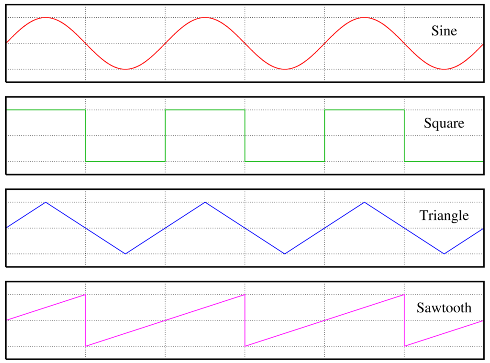
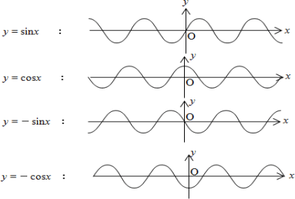
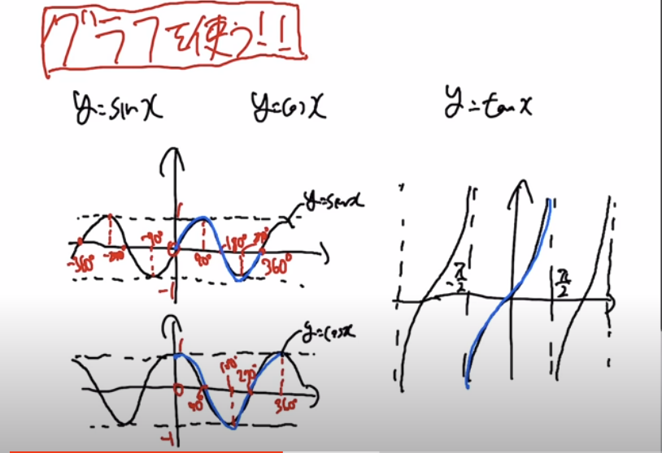
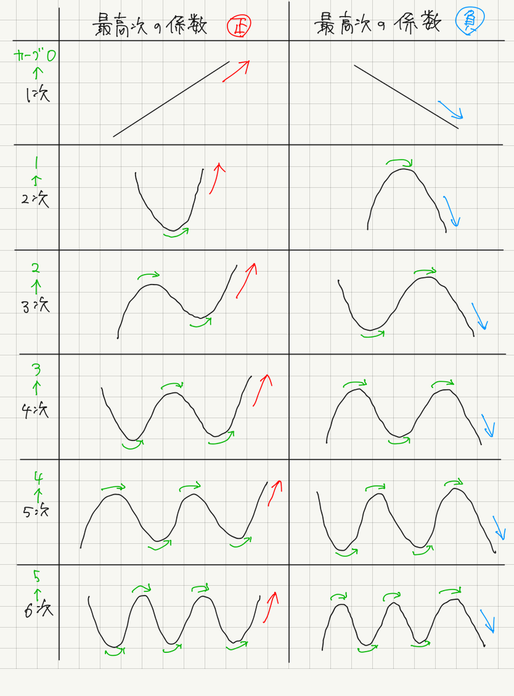
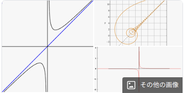
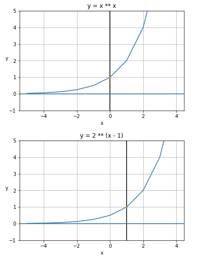
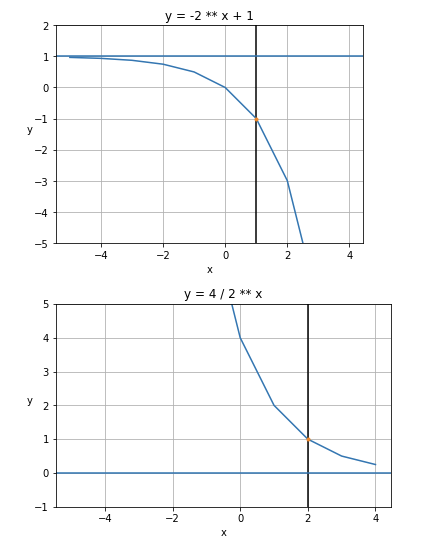

# Math

# 2進数 10進数 16進数

|16進|2進|10進|
| - | - | - |
|0|0000|0|
|1|0001|1|
|2|0010|2|
|3|0011|3|
|4|0100|4|
|5|0101|5|
|6|0110|6|
|7|0111|7|
|8|1000|8|
|9|1001|9|
|A|1010|10|
|B|1011|11|
|C|1100|12|
|D|1101|13|
|E|1110|14|
|F|1111|15|
|10|10000|16|

# 2進数

| 10進数 | 乗 | 16進数 | byte | C言語型|
| - | - | - | - | - |
| 1 | 2^0 | 0x1 | | |
| 2 | 2^1 | 0x2 | | |
| 4 | 2^2 | 0x4 | | |
| 8 | 2^3 | 0x8 | | |
| 16 | 2^4 | 0x10 | | |
| 32 | 2^5 | 0x20 | | |
| 64 | 2^6 | 0x40 | | |
| 128 | 2^7 | 0x80 | | |
| 256 | 2^8 | 0x100 | 1 | -128 ～ 127(255) |
| 512 | 2^9 | 0x200 | | |
| 1024 | 2^10 | 0x400 | | |
| 2048 | 2^11 | 0x800 | | |
| 4096 | 2^12 | 0x1000 | | |
| 8192 | 2^13 | 0x2000 | | |
| 16384 | 2^14 | 0x4000 | | |
| 32768 | 2^15 | 0x8000 | | |
| 65536 | 2^16 | 0x10000 | 2 | short int: -32768 ～ 32767(65535)|
| 4294967296 | 2^32 | 0x100000000 | 4 | int: -2147483648 ～ 2147483647(4294967295) |

# ビット演算

| OP | LEFT | LIGHT | RETURN |
| - | - | - | - |
| AND | 0 | 0 | 0 |
| AND | 1 | 0 | 0 |
| AND | 0 | 1 | 0 |
| AND | 1 | 1 | 1 |
| OR  | 0 | 0 | 0 |
| OR  | 1 | 0 | 1 |
| OR  | 0 | 1 | 1 |
| OR  | 1 | 1 | 1 |
| XOR | 0 | 0 | 0 |
| XOR | 1 | 0 | 1 |
| XOR | 0 | 1 | 1 |
| XOR | 1 | 1 | 0 |
| NOT | 0 | | 1 |
| NOT | 1 | | 0 |

| OP | RETURN |
| - | - |
| 0 & 0 | 0 |
| 1 & 0 | 0 |
| 0 & 1 | 0 |
| 1 & 1 | 1 |
| 0 \| 0 | 0 |
| 1 \| 0 | 1 |
| 0 \| 1 | 1 |
| 1 \| 1 | 1 |
| 0 ^ 0 | 0 |
| 1 ^ 0 | 1 |
| 0 ^ 1 | 1 |
| 1 ^ 1 | 0 |
| ~0 | -1 |
| 2 \| 0 | 2 |
| 2 \| 1 | 3 |
| 2 \| 2 | 4 |
| 2 \| 3 | 3 |
| 2 \| 4 | 6 |
| 2 \| 5 | 7 |
| 256 & 256 | 256 |
| 256 & 128 | 0 |
| 256 & 127 | 0 |
| 255 & 255 | 255 |
| 255 & 127 | 127 |

| OP | 2進数 | 10進数 |
| - | - | - |
| 0b1 << 1 | 0b00000010 | 2 |
| 0b1 << 2 | 0b00000100 | 4 |
| 0b1 << 3 | 0b00001000 | 8 |
| 0b1 << 4 | 0b00001000 | 16 |
| 0b1 << 5 | 0b00010000 | 32 |
| 0b1 << 6 | 0b00100000 | 64 |
| 0b1 << 7 | 0b01000000 | 128 |
| 0b1 << 8 | 0b10000000 | 256 |
| 3 << 1 | 0b10000000 | 6 |
| 3 << 2 | 0b10000000 | 12 |
| 3 << 3 | 0b10000000 | 24 |
| 3 << 4 | 0b10000000 | 48 |

# 基礎

## 整数（$\mathbb{Z}$）

1 とそれに 1 ずつ加えて得られる自然数と、それらに-1を乗じて得られる負数、およびに0を含む数の総称である。

## 自然数（$\mathbb{N}$）

自然数は正の整数である。
文脈によって0を含むことがある（その旨を明記する必要がある）。

厳密な自然数の定義については、ペアノの公理を参照。

## 実数（$\mathbb{R}$）

有理数と無理数を合わせて実数という。

## 有理数（$\mathbb{Q}$）

整数（正の数、0、負の数）は有理数。
二つの整数a, b（ただし、$b \ne 0 $）を用いて$a/b$という分数で表せる数。
有限小数は有理数。循環小数は有理数。

## 無理数

有理数でない実数を無理数という。
循環しない無限小数は無理数。
$\sqrt{x}$を外せない累乗根は無理数。

## 超越数

代数的数でない複素数のことである。

- ゲルフォント・シュナイダーの定理

## 複素数（$\mathbb{C}$）

# 代数学

数の代わりに文字を用いて方程式の解法などを研究する学問である。

## 虚数

2乗して$-1$となる数、すなわち、$-{\sqrt{1}}$を単位とする数でiと表す。
1 * -1 が$ 180^{\circ} $を回転するものとし、$ 90^{\circ} $ 回転に対応させるための数として発明された。
dimensions 複素数は必見である。

## 公式

### 素因数分解（ファクタライゼーション）

- $a^3 + b^3 = (a + b)(a^2 - ab + b^2)$
- $a^3 - b^3 = (a - b)(a^2 + ab + b^2)$
- $a^3 + b^3 + c^3 - 3abc = (a + b + c)(a^2 + b^2 + c^2 -ab - bc - ca)$

### 展開の公式

- $(a + b)^2 = a^2 + 2ab + b^2$
- $(a - b)^2 = a^2 - 2ab + b^2$
- $(a + b)^3 = a^3 + 3a^2b + 3ab^2 + b^3$
- $(a - b)^3 = a^3 - 3a^2b + 3ab^2 + b^3$

### 解の公式

解の公式はどんな方程式でも解けるため、因数分解・共通因数・平方完成などで解けない場合に利用できる。

一次方程式　$\displaystyle ax + b = 0 \quad (a\neq 0)$　の解は

- $\displaystyle x = -\frac{b}{a}$

二次方程式　$\displaystyle ax^{2}+bx+c=0\quad (a\neq 0)$　の解は

- $\displaystyle {x={\frac {-b\pm {\sqrt {b^{2}-4ac}}}{2a}}}$

三次方程式　$\displaystyle ax^{3}+bx^2+cx+d=0\quad (a\neq 0)$　の解は

- 長いため割愛

四次方程式　$\displaystyle ax^{4}+bx^3+cx^2+dx+e=0\quad (a\neq 0)$　の解は

- 長いため割愛

五次方程式　$\displaystyle ax^{5}+bx^4+cx^3+dx^2+ex+f=0\quad (a\neq 0)$　の解は

- アーベルルフィニの定理により存在しないことが証明されている（ただし、条件付きで解法が存在し、そのような方程式の一部はアーベル方程式と呼ばれる）

### 判別式

多項式の根が重根を持つための条件を与える、係数の多項式で最小のもののこと。
n次方程式の解がいくつあるか調べるために使用する。

判別式Dは次の性質を持つ。

- $D > 0$のとき、二次方程式は異なる実数解を2つ持つ。
- $D > 0$のとき、二次方程式は実数解を1つ（重解）持つ。
- $D < 0$​のとき、二次方程式は互いに共役な2つの複素数解を持つ。

一次方程式　$\displaystyle ax + b = 0 \quad (a\neq 0)$　の解は

- 必ず実数解が１つになるため、定義する必要がない。

二次方程式　$\displaystyle ax^{2}+bx+c=0\quad (a\neq 0)$​　の判別式は

- $D = b^2 - 4ac$
- $b = 2$のとき、$\frac{D}{4} = b^{r^2} - ac$

三次方程式　$\displaystyle ax^{3}+bx^2+cx+d=0\quad (a\neq 0)$　の判別式は

- 割愛

四次方程式　$\displaystyle ax^{4}+bx^3+cx^2+dx+e=0\quad (a\neq 0)$​　の判別式は

- 割愛

五次方程式　$\displaystyle ax^{5}+bx^4+cx^3+dx^2+ex+f=0\quad (a\neq 0)$​　の判別式は

- 割愛（解の公式は存在しないが、判別式は常に定義される）

## 黄金比

- $\displaystyle 1 : \frac{1 + \sqrt{5}}{2}$

# 線形代数

線形空間と線形変換を中心とした理論を研究する代数学の一分野である。

複雑な連立方程式を解くために発明された。
複数の方程式をベクトルに抽象化する。

線形代数と統計・経済は相性がよい。
経済とは、様々な方程式が交わって結果を出力する関数であり、その中からいくつかの方程式（統計）を取り出しベクトルに抽象化することで相関関係を導くことができる。

## 数ベクトル空間

- ユークリッド空間
- アフィン空間

## 内積空間

- 内積
- エルミート内積 
- 直交補空間
- 直交射影

## 線形結合（一次結合）

- 線型従属（一次従属）
- 線型独立（一次独立）
- 基底
- 標準基底
- 次元
- グラム・シュミットの正規直交化法

## 行列

- 実行列
- 複素行列
- 正方行列
- 正則行列 (GL(n, R), GL(n, C))
- 逆行列
- 単位行列（スカラー行列）
- 零行列
- 冪零行列
- 対角行列
- 三角行列（上三角行列、下三角行列）
- 転置行列
- 随伴行列
- 直交行列 (O(n))
- 特殊直交行列 (SO(n))
- ユニタリ行列 (U(n))
- 特殊ユニタリー行列 (SU(n))
- シンプレクティック行列 (Sp(n))
- 行列指数関数
- 対称行列
- 反対称行列（歪対称行列）
- エルミート行列
- 歪エルミート行列（反エルミート行列）
- 正規行列
- 置換行列
- 隣接行列

## 行列式

- 置換
- 小行列式
- 余因子展開
- ヤコビアン
- 関数行列

## 線型方程式系（連立一次方程式）

- 行列の基本変形
- クラメールの公式
- シルベスター行列

## 線型変換（一次変換）

- 線型写像（線型変換）
- 相似
- 成分行列
- 階数
- 像
- 核（核空間）
- 対角化
- スペクトル分解
- ジョルダン標準形
- 特異値分解

## 固有空間

- 固有値
- 固有ベクトル
- フロベニウスの定理
- 固有多項式（固有方程式）
- 最小多項式
- ケイリー・ハミルトンの定理
- 縮退

## テンソル

- 双対空間
- 双線型形式
- 対称形式
- エルミート形式
- テンソル代数
- グラスマン代数

# 幾何学

図形や空間の性質を研究する学問である。

## 円周率

円の直径に対する円周の長さの比率を表す定数である。

- 無理数（有理数でない実数、つまり、分子・分母ともに整数である分数として表せない）である
- 超越数（代数方程式の解とはならない数）である
- 小数展開は巡回しない（円周率の無理性の証明）

## 三角形

### ピタゴラスの定理（三平方）

$a^2 + b^2 = c^2$

### 三角関数

- sin
- cos
- tan
- sec
- csc
- cot

| $角度 \theta$ | $0^{\circ}$ | $30^{\circ}$ | $45^{\circ}$ | $60^{\circ}$ | $90^{\circ}$ | $120^{\circ}$ | $135^{\circ}$ | $150^{\circ}$ | $180^{\circ}$ |
| ------------- | ----------- | ----------- | ----------- | ----------- | ----------- | ----------- | ----------- | ----------- | ----------- |
| $\sin \theta$ | $0$ | $\frac{1}{2}$ | $\frac{1}{\sqrt{2}}$ | $\frac{\sqrt{3}}{2}$ | 1 | $\frac{\sqrt{3}}{2}$ | $\frac{1}{\sqrt{2}}$ | $\frac{1}{2}$ | $0$ |
| $\cos \theta$ | $1$ | $\frac{\sqrt{3}}{2}$ | $\frac{1}{\sqrt{2}}$ | $\frac{1}{2}$ | $0$ | $\frac{-1}{2}$ | $\frac{1}{-\sqrt{2}}$ | $\frac{-\sqrt{3}}{2}$ | $-1$ |
| $\tan \theta$ | 0 | $\frac{1}{\sqrt{3}}$ | $1$ | $\sqrt{3}$ | - | $-\sqrt{3}$ | $-1$ | $\frac{1}{-\sqrt{3}}$ | $0$ |

## 四元数

複素数を拡張した数体系であり、虚数単位i,j,kを用いて次のように表す。

$a + bi + cj + dk$

ここで、a,b,c,dは実数であり、

$i^2 = j^2 = k^2 = ijk = -1$

となる。

## 図形

### 三角形

- 三平方の定理　＝　$a^2 + b^2 = c^2$
- 面積　＝　底辺　×　高さ　÷　２
- $S = 1/2 ab sin \theta$（２辺とその間の角の大きさを使った公式）
- 内接円を使った公式
- 外接円を使った公式
- ３辺の長さから求める（ヘロンの公式）

### 円

- 円周：　$2 * radius * \pi$

### 楕円

### 球

### 楕円体

### 三角錐

### 円錐

### 楕円錐

## 波形・信号処理

### 正弦波（sin波・cos波）

### 非正弦波

正弦波でない波を非正弦波という。

### 矩形波（Square）

### 方形波

矩形波と区別はないという噂の一方、
方形波は矩形波のうちDuty50%のみに使うという噂もある。

### 三角波（Triangle）

### 台形波

### 階段波

### パルス波

振幅が最大値と最小値のどちらかの値をとるように周期的に変化する音色

### のこぎり（Sawtooth）

## N次関数

## 漸近線

十分遠くで曲線との距離が 0 に近づき、かつ曲線と接しない[直線](https://ja.wikipedia.org/wiki/直線)のことである。通常の定義では、漸近線は曲線と無限回交わってもよい。

## 指数関数

# 解析学

解析学は関数の性質を研究する数学の分野であり、極限や収束といった概念を扱う。

## 数列

### 等差数列

隣接する項が共通の差（公差）を持つ数列。ガウスのエピソードは必見。

項数$n$、初項$a_1$、公差dの等差数列の総和（Summation）を$S$とすると

- $S = a_1 + a_2 + ... + a_n$​
- $S = \sum_{k=1}^{n} a_k$​
- $S = \frac{1}{2}n(a_1 + a_n)$​　
- $a_n = a_1 + (n − 1)d$

| 記法 |  |  | 答え | 項の求め方 |
| - | - | - | - | - |
| $\displaystyle \sum_{k=1}^{2} k$ | 1 + 2 | $\frac{1}{2}\cdot2(1 + 2)$ | 3 | $a_2 = 1 + (2 − 1)\cdot1$ |
| $\displaystyle \sum_{k=1}^{3} k$ | 1 + 2 + 3 | $\frac{1}{2}\cdot3(1 + 3)$ | 6 | $a_3 = 1 + (3 − 1)\cdot1$ |
| $\displaystyle \sum_{k=1}^{100} k$ | 1 + 2 + ... + 100 | $\frac{1}{2}\cdot100(1 + 100)$ | 5050 | $a_{100} = 1 + (100 − 1)\cdot1$ |
| $\displaystyle \sum_{k=1}^{2} 2k$ | 2 + 4 | $\frac{1}{2}\cdot2(2 + 4)$ | 6 | $a_2 = 2 + (2 − 1)\cdot2$ |
| $\displaystyle \sum_{k=1}^{2} 3k$ | 3  + 6 | $\frac{1}{2}\cdot2(3 + 6)$ | 9 | $a_2 = 3 + (2 − 1)\cdot3$ |

その他

- $\displaystyle \sum_{k=1}^{n} k^2 = \frac{1}{6}(n + 1)(2n + 1)$
- $\displaystyle \sum_{k=1}^{n} k^3 = \{\frac{1}{2}n(n + 1)\}^2$
- $\displaystyle \sum_{k=1}^{n} ar^{k-1} = \frac{a(1 - r^n)}{(1 - r)} = \frac{a(r^n - 1)}{r - 1}$

### 等比数列

隣り合う二項の比が項番号によらず等しい数列。各項に共通する一定の比を公比という。

- $\displaystyle S = ar^0 + ar^2 + ... + ar^{n-1}$​
- $\displaystyle S = \sum_{k=1}^{n} ar^{k-1}$​
- $\displaystyle \sum_{k=1}^{n} ar^{k-1} = (r \ne 1)のとき、\frac{a(1-r^n)}{1-r}$
- $\displaystyle \sum_{k=1}^{n} ar^{k-1} = (r \ne 1)のとき、\frac{a(r^n-1)}{r-1}$　
- $\displaystyle \sum_{k=1}^{n} ar^{k-1} = (r = 1)のとき、\sum_{k=1}^{n}{a} = na$

### 階差数列

隣り合う項の差をとることによってできる新たな数列。

- ${\displaystyle b_{n}=a_{n+1}-a_{n}}$

### 漸化式

各項がそれ以前の項の関数として定まるという意味で数列を再帰的に定める等式である。
差分方程式と呼ばれることもある。

漸化式の例

- フィボナッチ数列：　 $a_1 = a_2 = 1$ | $a_{n+2} = a_{n+1} + a_n (n \geq 1)$
- ロジスティック写像：　$x_{n+1} = rx(1 - x_n)$

## 極限

数の列がある値に限りなく近づくとき、その値を数列の極限あるいは極限値といい、この数列は収束するという。収束しない場合は、正の無限大、負の無限大、振動することを発散という。

- $\displaystyle \lim_{x \to \infty}(1 + \frac{1}{x}) = e$
- $\displaystyle \lim_{x \to 0}\frac{e^x - 1}{x} = 1$
- $\displaystyle \lim_{x \to 0}\frac{\sin{x}}{x} = 1$

### ネイピア数

自然対数の底であり、数学定数の一つである。
通常$e$と表記され、$e = 2.71828 ...$と続く超越数である。
$\displaystyle e = \lim_{n \to \infty}(1 + \frac{1}{n})^n$

$\displaystyle e = \lim_{n \to 0}(1 + \frac{1}{n})^{\frac{1}{n}}$

ネイピア数は複利計算を参考にするとよい。
年利100%の商品があり、権利獲得の期間を極限まで分割（N分割しN回金利を受け取ると年利100%を超える）するとネイピア数が求まる。

| n       | 式                                                           | 答え       |
| ------- | ------------------------------------------------------------ | ---------- |
| 1       | $\displaystyle \lim_{1 \to \infty}(1 + \frac{1}{1})^1$       | 2          |
| 2       | $\displaystyle \lim_{2 \to \infty}(1 + \frac{1}{2})^2$       | 2.25       |
| 3       | $\displaystyle \lim_{3 \to \infty}(1 + \frac{1}{3})^3$       | 2.37037... |
| 4       | $\displaystyle \lim_{4 \to \infty}(1 + \frac{1}{4})^4$       | 2.44140625 |
| 5       | $\displaystyle \lim_{5 \to \infty}(1 + \frac{1}{5})^5$       | 2.48832    |
| 6       | $\displaystyle \lim_{6 \to \infty}(1 + \frac{1}{6})^6$       | 2.52162... |
| 7       | $\displaystyle \lim_{7 \to \infty}(1 + \frac{1}{7})^7$       | 2.54649... |
| 8       | $\displaystyle \lim_{8 \to \infty}(1 + \frac{1}{8})^8$       | 2.56578... |
| 9       | $\displaystyle \lim_{9 \to \infty}(1 + \frac{1}{9})^9$       | 2.58117... |
| 10      | $\displaystyle \lim_{10 \to \infty}(1 + \frac{1}{10})^{10}$  | 2.59374... |
| 365     | $\displaystyle \lim_{365 \to \infty}(1 + \frac{1}{365})^{365}$ | 2.71456... |
| 3650    | $\displaystyle \lim_{3650 \to \infty}(1 + \frac{1}{3650})^{3650}$ | 2.71790... |
| 36500   | $\displaystyle \lim_{36500 \to \infty}(1 + \frac{1}{36500})^{36500}$ | 2.71824... |
| 3650000 | $\displaystyle \lim_{3650000 \to \infty}(1 + \frac{1}{3650000})^{3650000}$ | 2.71828... |

対数関数log a x上の点(1, 0)接戦の傾きが1（y=-1 x=1を通る直線との節点）となるような底aのような値を表す。
傾きとはxの変化量に対するyの変化量の比のこと。

## 二項定理

$(a+b)^n$を展開したときの各項の係数は$nCk$になる。

$\displaystyle (a + b)^n = \sum_{k=0}^n nCk a^{n-k}b^k$

$n = 3$とおくと、

$\displaystyle (a + b)^3 = \sum_{k=0}^3 3Ck a^{3-k}b^k$

$\displaystyle = 3C_0a^3 + 3C_1a^2b + 3C_2ab^2 + 3C_3b^3$

- $\displaystyle (x + y)^2 = x^2 + 2xy + y^2$
- $\displaystyle (x + y)^3 = x^3 + 3x^2y + 3xy^2 + y^3$
- $\displaystyle (x + y)^4 = x^4 + 4x^3y + 6x^2y^2 + 4xy^3 + y^4$

## 累乗・指数
$a$を$n$個かけ合わせたものを$a \times a \times ... \times a$を$a_n$と書き、$a$の$n$乗と読む。
$n$は$a_n$のべき指数といい、$a_1$, $a_2$ ...を$a$の１乗、$a$​の２乗...という。これらの総称を累乗という。

### 指数法則など

- $\displaystyle a^m a^n = a^{m+n}$
- $\displaystyle (a^m)^n = a^{mn}$
- $\displaystyle (ab)^n = a^n b^n$
- $\displaystyle (\frac{a}{b})^n = \frac{a^n}{b^n}$
- $\displaystyle a^0 = 1$
- $\displaystyle a^{-n} = \frac{1}{a^n}$
- $\displaystyle \frac{1}{a^n} = a^{-n}$
- $\displaystyle a^m \div a^n = a^{m-n}$

|                        |                                       |
| ---------------------- | ------------------------------------- |
| $\displaystyle 3^0$    | $\displaystyle 1$                     |
| $\displaystyle 3^{-1}$ | $\displaystyle \frac{1}{3}$           |
| $3^{-2}$               | $\displaystyle \frac{1}{9}$           |
| $3^{-3}$               | $\displaystyle \frac{1}{27}$          |
| $(-3)^1$               | $\displaystyle -3$                    |
| $(-3)^2$               | $\displaystyle 9$                     |
| $(-3)^3$               | $\displaystyle -27$                   |
| $(-1)^0$               | $\displaystyle 1$                     |
| $(-1)^1$               | $\displaystyle -1$                    |
| $(-1)^2$               | $\displaystyle 1$                     |
| $-5^2$                 | $-5 \times 5 = -25$                   |
| $-5^3$                 | $-5 \times 5 \times 5 = -125$         |
| $(-5)^2$               | $(-5) \times (-5) = 25$               |
| $(-5)^3$               | $(-5) \times (-5) \times (-5) = -125$ |
| $-(-5^2)$              | $-(-5 \times 5) = 25$                 |
| $-(-5^3)$              | $-(-5 \times 5 \times 5) = 125$       |

$a > 0, b > 0 かつ r, sが有理数のとき$

- $a^r a^s = a^{r + s}$
- $(a^r)^s = a^{rs}$
- $(ab)^r = a^r b^r$

### 累乗根・平方根

$$\displaystyle X^n = a \quad (a > 0)となる元の数Xをaのn乗根といい、\sqrt[n]{a}で表す。$$
$n = 2$ のとき、単に$\sqrt{a}$と略してよい。
$a = 0$ のとき、nが偶数でも奇数でも0となる。$\sqrt[n]{0} = 0$

### 累乗根の性質

$a > 0, b > 0 で、 m, nが正の整数のとき$

- $\displaystyle \sqrt[n]{a}\sqrt[n]{b} = \sqrt[n]{ab}$
- $\displaystyle \sqrt[n]{a}\sqrt[n]{b} = \sqrt[n]{ab}$
- $\displaystyle \frac{\sqrt[n]{a}}{\sqrt[n]{b}} = \sqrt[n]{\frac{a}{b}}$
- $\displaystyle (\sqrt[n]{a})^m = \sqrt[m]{a^m}$
- $\displaystyle \sqrt[m]{\sqrt[n]{a}} = \sqrt[mn]{a}$
- $\displaystyle \sqrt[np]{a^{mp}} = \sqrt[n]{a}$
- $\displaystyle \sqrt[n]{a^m} = a^{\frac{m}{n}}$
- $\displaystyle \sqrt[n]{a^m} = \sqrt[n]{a}^m$

|                                                 |                                                              |                                   |
| ----------------------------------------------- | ------------------------------------------------------------ | --------------------------------- |
| $\displaystyle \sqrt[4]{0.0016}$                | $\displaystyle \sqrt[4]{2^4 \times 10^{-4}} = \sqrt[4]{\frac{2^4}{10^4}}$ | 0.2                               |
| $\displaystyle \sqrt[5]{-1024}$                 | $\displaystyle \sqrt[5]{-2^{10}} = \sqrt[5]{-2^{2 \times 5}}$ | $-4$                              |
| $\displaystyle \sqrt[4]{0.0016}$                | $0.0016^{\frac{1}{4}}$                                       |                                   |
| $\displaystyle \sqrt[5]{2^6}$                   | $\displaystyle (\sqrt[5]{2})^6$                              | $2\sqrt[5]{2}$                    |
| $\displaystyle \sqrt[3]{xy^3}$                  |                                                              | $y\sqrt[3]{x}$                    |
| $\displaystyle \sqrt[5]{x^5 y^{11}}$            |                                                              | $xy^2\sqrt[5]{y}$                 |
| $\displaystyle \sqrt{a\sqrt[3]{a \sqrt[4]{a}}}$ | $\displaystyle \sqrt{a\sqrt[3]{a^{\frac{5}{4}}}} = \sqrt{a * a^{\frac{5}{12}}} = \sqrt{a^{\frac{17}{12}}} = a^{\frac{17}{24}}$ | $\displaystyle \sqrt[24]{a^{17}}$ |

$\displaystyle 4\sqrt[5]{2}$ 　⇛　４の５累乗根２と読む

### 素因数分解

### 開平計算法

## 対数（logarithm）

aを底とするbの対数（冪指数）xを次のように表す。

$log_{a}b = x$

冪指数は次のような関係がある。

$a^x = b$ ただし、$(1 < a)$

| MATH | Python | 訳 | 答 | 冪指数 |
| - | - | - | - | - |
| $\log_1 1$ | log(1, 1) | 1を底とする1の対数 | エラー（なぜ？） | $1^1 = 1$ |
| $\log_2 4$ | log(4, 2) | 2を底とする4の対数 | 2 | $2^2 = 4$ |
| $\log_2 8$ | log(8, 2) | 2を底とする8の対数 | 3 | $2^3 = 8$ |
| $\log_3 9$ | log(9, 3) | 3を底とする9の対数 | 2 | $3^2 = 9$ |
| $\log_4 16$ | log(16, 4) | 4を底とする16の対数 | 2 | $4^2= 16$ |
| $\log_5 25$ | log(25, 5) | 5を底とする25の対数 | 2 | $5^2 = 25$ |

## 微分積分

微分と積分は別学問として取り扱われていたが、ニュートン・ライプニッツ（1700年）により表裏一体の関係が発見され、微分積分学として発展した。

- 区分求積法
- リーマン積分（区分求積法の考えをより広く適用できるように発展させたもの）
- ルベーグ積分（リーマン積分で対応できない不規則な関数でも対応できる。リーマン積分が縦切りのアプローチで、ルベーグ積分は横切りのアプローチになる）
- リーマン＝スティルチェス積分-
- ルベーグ＝スティルチェス積分
- 重積分
- ダニエル積分-
- リーマン型
- ヤング積分
- 確率積分
- 伊藤積分
- ストラトノヴィッチ積分
- 不変積分

## 微分
傾きの変化（傾き）を表すグラフを導くことを微分するという。xが限りなく近くしたときのyの変化量など、瞬間的な変化（接点）を計算する。

関数$f(x)$に対して、導関数（ある関数を微分して得られる関数）$f\prime(x)$は以下の式で定義される。

$\displaystyle f\prime(x) = \lim_{h \to 0}\frac{f(x + h) - f(x)}{h}$

$\displaystyle \frac{d_y}{d_x} = y(x)$

## 積分

ある関数から得られる領域の面積を求める。複雑な図形を面積を求める。
三角形を縦に極限まで細かく刻んだものを四角形と見なし三角形に当てはめる試み。

$\displaystyle \int_{a}^{b}f(x)dx = \left[F(x)\right]_a^b = F(b) - F(a)$

関数f(x)をaからbまで積分するという。a,bは積分区間で、それぞれ下端・上端と呼ぶ。

$\displaystyle \int$と$dx$に囲まれている関数は原子関数と呼び、dxは極めて小さな変化量を意味する。あるいは、xに着目するという意味。

|                                     |                              |
| ----------------------------------- | ---------------------------- |
| $\displaystyle \int_{0}^{1}f(x)dx$  | $\displaystyle \frac{1}{2}$  |
| $\displaystyle \int_{0}^{2}f(x)dx$  | $2$                          |
| $\displaystyle \int_{0}^{3}f(x)dx$  | $\displaystyle \frac{9}{2}$  |
| $\displaystyle \int_{0}^{4}f(x)dx$  | 8                            |
| $\displaystyle \int_{0}^{5}f(x)dx$  | $\displaystyle \frac{25}{2}$ |
| $\displaystyle \int_{0}^{6}f(x)dx$  | $\displaystyle 18$           |
| $\displaystyle \int_{0}^{7}f(x)dx$  | $\displaystyle \frac{49}{2}$ |
| $\displaystyle \int_{0}^{8}f(x)dx$  | $\displaystyle 32$           |
| $\displaystyle \int_{0}^{9}f(x)dx$  | $\displaystyle \frac{81}{2}$ |
| $\displaystyle \int_{0}^{10}f(x)dx$ | 50                           |

## 色々な微分・積分

### 偏微分

例えば、$y = f(x, z)$​​など幅と奥行きを指定すると高さが求まるような多変数関数において、観点とする１変数以外の変数を定数化することで対象軸に対する変化を算出する。

### 重積分

一変数の実函数に対する定積分を多変数函数に対して拡張したものである

### 線績分

曲線に沿って評価された函数の値についての積分の総称。初めに学ぶ最も一般的な積分。

### 周回積分（閉路積分）

閉曲線に沿う線積分を特に閉路積分（へいろせきぶん）あるいは周回積分（しゅうかいせきぶん）と呼ぶ。

## リーマン予想

リーマンゼータ関数： $\zeta(s)$
sは複素数
nは自然数
$$\zeta(s) =\sum_{n=1}^{\infty} \frac{1}{n^s}$$

解析学 e
代数学 i
幾何学 π
情報単位元 1
下方単位元 0

# 離散数学

グラフ理論、組み合わせ理論、最適化問題、計算幾何学、プログラミング、アルゴリズム論が絡む応用分野で、包括的・抽象的に表現する際に用いられることが多い。

## 階乗（Factorial）

階乗とは、1～n までのすべての自然数の積である。

$n!=n⋅(n−1)⋅(n−2)⋯2⋅1$

| 階乗 | 計算                                   | 答え    |
| ---- | -------------------------------------- | ------- |
| 0!   |                                        | 1       |
| 1!   | 1                                      | 1       |
| 2!   | 2 * 1                                  | 2       |
| 3!   | 3 * 2 * 1                              | 6       |
| 4!   | 4 * 3 * 2 * 1                          | 24      |
| 5!   | 5 * 4 * 3 * 2 * 1                      | 120     |
| 6!   | 6 * 5 * 4 * 3 * 2 * 1                  | 720     |
| 7!   | 7 * 6 * 5 * 4 * 3 * 2 * 1              | 5040    |
| 8!   | 8 * 7 * 6 * 5 * 4 * 3 * 2 * 1          | 40320   |
| 9!   | 9 * 8 * 7 * 6 * 5 * 4 * 3 * 2 * 1      | 362880  |
| 10!  | 10 * 9 * 8 * 7 * 6 * 5 * 4 * 3 * 2 * 1 | 3628800 |

## 素数階乗（Primorial factorial）

- $pn\# = \prod_{n}^{i=1}pi$

| 階乗 | 計算                                  | 答え      |
| ---- | ------------------------------------- | --------- |
| 2#   | 2                                     | 2         |
| 3#   | 2 * 3                                 | 6         |
| 5#   | 2 * 3 * 5                             | 30        |
| 7#   | 2 * 3 * 5 * 7                         | 210       |
| 11#  | 2 * 3 * 5 * 7 * 11                    | 2310      |
| 13#  | 2 * 3 * 5 * 7 * 11 * 13               | 30030     |
| 17#  | 2 * 3 * 5 * 7 * 11 * 13 * 17          | 510510    |
| 19#  | 2 * 3 * 5 * 7 * 11 * 13 * 17 * 19     | 9699690   |
| 23#  | 2 * 3 * 5 * 7 * 11 * 13 * 17 * 19 *23 | 223092870 |

## 順列（Permutation）

異なる n 個のものの中から r 個取り出して順番に１列に並べた組み合わせの数。
異なる n 個から r 個取り出した通りの総数を $nPr$ と表す。

- $nPr = n(n - 1)(n - 2) ... (n - r + 1)$
- $\displaystyle nPr = \frac{n!}{(n - r)!}$

| $nPr$ | 式１ | 式２ | 答え |
| ----- | --------------------------------- | ----------------------------------- | ---- |
| $\displaystyle 5P5 $ | $5(5 - 1)(5 - 2)(5 - 3)(5 - 4)(5 - 5 + 1)$ | $\displaystyle \frac{5!}{(5 - 5)!}$ | 120 |
| $\displaystyle 5P4 $ | $5(5 - 1)(5 - 2)(5 - 3)(5 - 4 + 1)$ | $\displaystyle \frac{5!}{(5 - 4)!}$ | 120 |
| $\displaystyle 5P3 $ | $5(5 - 1)(5 - 3 + 1)$ | $\displaystyle \frac{5!}{(5 - 3)!}$ | 60 |
| $\displaystyle 5P2 $ | $5(5 - 2 + 1)$ | $\displaystyle \frac{5!}{(5 - 2)!}$ | 20 |
| $\displaystyle 5P1 $ | $(5 - 1 + 1)$ | $\displaystyle \frac{5!}{(5 - 1)!}$ | 5 |

## 組み合わせ（Combination）

異なるn個からr個選ぶ組み合わせの数。

- $\displaystyle nCr = \frac{nPr}{r!}$
- $\displaystyle nCr = \frac{n(n - 1)(n - 2) ... (n - r + 1)}{r(r - 1) ... 3\cdot2\cdot1}$
- $\displaystyle nCr = \frac{n!}{r!(n - r)}$

| $nCr$               | 式１                           | 式２                                 | 答え |
| ------------------- | ------------------------------ | ------------------------------------ | ---- |
| $\displaystyle 5C5$ | $\displaystyle \frac{5P5}{5!}$ | $\displaystyle \frac{!}{r!(n - r)}$  | 1    |
| $\displaystyle 5C4$ | $\displaystyle \frac{5P4}{4!}$ | $\displaystyle \frac{5!}{4!(5 - 4)}$ | 5    |
| $\displaystyle 5C3$ | $\displaystyle \frac{5P3}{3!}$ | $\displaystyle \frac{5!}{3!(5 - 3)}$ | 10   |
| $\displaystyle 5C2$ | $\displaystyle \frac{5P2}{2!}$ | $\displaystyle \frac{5!}{3!(5 - 3)}$ | 10   |
| $\displaystyle 5C1$ | $\displaystyle \frac{5P1}{1!}$ | $\displaystyle \frac{5!}{3!(5 - 3)}$ | 5    |

# 統計学

## 回帰分析

結果となる数値と要因となる数値の関係を調べて、それぞれの関係を明らかにする統計的手法です。 

## 最尤推定

統計学において、与えられたデータからそれが従う確率分布の母数を点**推定**する方法である。

## 最小二乗法

測定で得られた数値の組を、適当なモデルから想定される1次関数、対数曲線など特定の関数を用いて近似するときに、想定する関数が測定値に対してよい近似となるように、残差の二乗和を最小とするような係数を決定する方法。

# 機械学習・ディープラーニング

機械学習とは、膨大なデータをもとにコンピュータがルールやパターンを獲得します。機械学習は、教師あり学習、教師なし学習、強化学習に分類できます。

機械学習は、パラメータ（特徴量）を必要としますが、ディープラーニングはコンピュータ自身がパラメータを探し学習します。

## 学習方法

- 教師あり学習
- 教師なし学習
- 反教師あり学習
- 強化学習

## 回帰分析

## 決定木

### 分類木

式１のyが、性別のように、分類可能な変数で、分類を目的にして、決定木のアルゴリズムを使用する場合

### 回帰木

不動産の家賃の変動や、株価の変動等、分類ではなく、過去、及び、現在のデータから、未来の数値を予想する場合

## ランダムフォレスト

複数の決定木（ディシジョン・ツリー）から平均・多数決を算出する予測モデル。

## k近傍法（k-MN）

機械学習アルゴリズムの中で最も単純とされているのがk近傍法（ケイきんぼうほう）です。

すでに答えが明確な問題を教師とともに学習する手法で、学習データをベクトル空間上にプロットしておき、未知のデータが現れた際には距離の近い方のデータを任意でk個取得します。そして最終的には多数決によってデータが属するクラスを推定します。

## k平均法（k means clustering）

クラスタリングの最も簡単な手法の一つであり，教師なし学習です。
ベクトル空間上にプロットされた密集区域で分類します。

## ニューラルネットワーク

ヒトの脳神経系ニューロンを数理モデルに落とし込んだアルゴリズムです。

このモデルには教師あり学習と教師データなしの学習の２つがあり、誤差逆伝播法によってパラメータを調整します。

デメリットは、大量の計算リソースが必要であること。

## サポートベクターマシン

優れた認識性能を発揮する教師あり学習モデルです。

分類や回帰の問題解決に役立ち、異なるクラスの境界線を明確に分けることができます。

境界の種類は、2次元なら線、3次元なら平面、n次元なら超平面となります。

## ナイーブベイズ（単純ベイズ分類器）

確率論の定理であるベイズの定理を基にしたアルゴリズムです。入力データから全ての推定の確率を算出し、最も確からしい結果を出力します。教師あり学習モデルであり、文書データとの相性が良い点が特徴です。

メールフィルタリングなどに用いられる。

## 正則化(Regularization)

機械学習における過学習を防ぐ手段としてよく用いられています。

## ロジスティック回帰

複数の要因が考えられる際に、特定の事象が起こる確率を予測するために用いられるモデル。

## マルコフ連鎖

マルコフ連鎖モンテカルロ法（MCMC）では、マルコフ連鎖を使用することによってモンテカルロ法が強化されます。この方法で最も広く用いられているのは、多重積分の計算です。一様分布や正規分布とは異なる確率分布で、乱数を生成できるというメリットがあり、ランダムにサンプリングを実行するモンテカルロ法ではデメリットとなる計算コストの高さや精度の低さも、マルコフ連鎖を運用することで改善できます。

# 数論

数、特に整数およびそれから派生する数の体系（代数体、局所体など）の性質について研究する数学の一分野である。整数論とも言う。

# オイラーの等式
$$e^{i\pi} + 1 = 0$$
$$e^{i\theta} = \cos\theta + i\sin\theta$$

# フェルマーの最終定理
$$x^n + y^n = z^n$$

# 位相幾何学（トポロジー）

位置の学問を意味する。

何らかの形・空間を連続変形（切ったり貼ったりを除く）が可能であれば図形は同一視される。
具体的な解を求めるのでなく、解が存在するかしないか証明する問題で効果がある。

身近な例

- 路線図
- ネットワーク図（リング型・スター型・バス型）

関連キーワード

- グラフ理論
- ファイブレーション

# グラフ
２つ以上の数量や関数の関係を図形に示したもの。
グラフは文脈で意味が異なり。

1. 情報を二次元平面上に表したもの。
2. 頂点と辺（節点と枝）からなる構造。

# 数1と数Aの違い

- 数１：式の計算・方程式・不等式・2次関数・2次不等式・三角比・図形の計量
- 数A：場合の数・確率・論理と集合・平面図形

数Aは全ての高校で学習科目となっているわけでなく、やや難しく進学校向けとなっている。

# 機械学習

機械学習で特に必要と成る教養は、線形代数・微分・ベクトル・確率統計と指数関数・数列・三角関数などの基礎知識。

シグモイド関数

ユークリッド距離

フェルミ推定

ベイズの定理

# シグモイド関数

- 入力値を0から1に収めてくれる。
- xが大きくなりとyが$\frac{1}{2}$のとき最も大きいカーブを描き、0に1に近づくとyは緩やかに収束する。（S字）
- すなわち、0.5は一般的で精度が高い可能性が高く、極限に近づくほどハズレ値であるある可能性が高いことを示す

# ベイズの定理

ある事象に関連する可能性のある条件について事前知識に基づいて、その事象の確率を記述するもの。

$P(B | A) = \frac{P(B | A)P(A)}{P(B)}$

$P(A | B)$は条件付き確率であり、${\displaystyle B}$が真であるとき事象${\displaystyle A}$が発生する確率である。
$P(B | A)$は条件付き確率であり、${\displaystyle A}$が真であるとき事象${\displaystyle B}$が発生する確率である。
$P(A)$と$P(B)$​は、与えられた条件なしにAとBがそれぞれ観測される確率である。

# ユークリッド距離

人が定規で測るような2点間の通常の距離であり、ピタゴラスの公式によって与えられる。

# フェルミ推定

実際に調査が難しい量を手掛かりから推定する。
手掛かりをパラメータ化し、パラメータを調査しより具体的な推定に近づけさせる。

# 数学定数

- 0
- 1
- 円周率
- ネイピア数
- iのi乗
- 

# 数学と物理の違い

物理はビッグバン以降に生じた法則を解き明かす学問で、数学はビッグバンとは無関係に存在している法則を解き明かす学問。

数学は、前提や公理から矛盾しない答えを導く。
物理は、観測した現象から数式で説明できる過程を探す。

# 計算サイト

- https://www.symbolab.com/solver/step-by-step/-5%5E%7B2%7D?or=input
- 